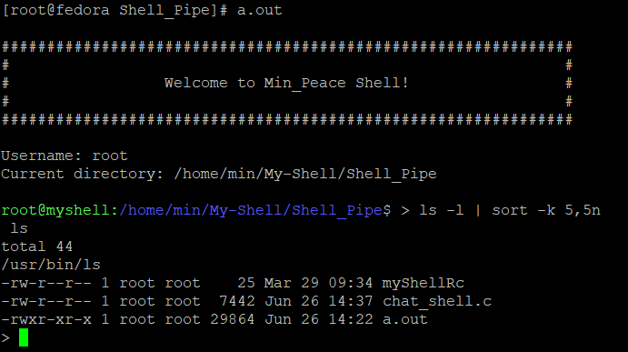
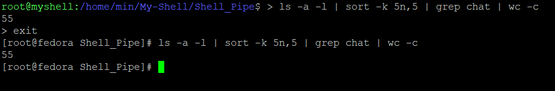
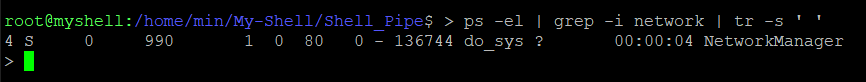

# My-Shell
기존에 시스템 프로그래밍에서 만든 My_Shell에서 좀 더 다양한 기능을 추가해보고자 My-Shell 레포지트를 따로 만들어서 작업하고자 합니다.

총 목표
1. Multi-Pipe(6.26 완료)
2. redirection션(>) 
3. 프로세스 -> 쓰레드 전환 ( 이건 고려 중)
_____
# 1.Multi-Pipe
> 내가 생각한 파이프의 흐름대로 진행되지않아 많은 수정과정을 거쳤음. 

**에러사항**
* 1. 단일 pipe를 통해 pipe 처리 함수를 재귀적으로 불러봐 처리 
 :    
 함수내에서 pipe 동작 구현이 생각처럼 진행되지않아 다른방법고안
* 2. pipe 와 임시 tmp역할하는 file open 후 write하고 다음 pipe에서 내용읽어와서 pipe-file 구조로 Multi-pipe:     
I/O 처리 및 비 효율적인 Memory 사용방법

**해결방법**
* 동적으로 필요한 Pipe를 생성하여 Linked List와 비슷한 방법으로 이전 Pipe 현재 Pipe를 서로 이어서 이전 값을 불러와서 처리함.
* **EX**                 
dup2(pipes[j][0], 0);             
dup2(pipes[j+1][1], 1);
----
># 결과 사진

