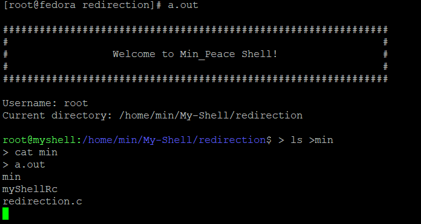
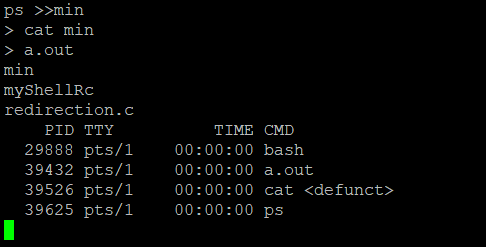

# My-Shell
기존에 시스템 프로그래밍에서 만든 My_Shell에서 좀 더 다양한 기능을 추가해보고자  My-Shell 레포지트를 따로 만들어서 작업하고자 합니다.

총 목표
1. Multi-Pipe(6.26 완료)
2. redirection(>) (6.28 완료)
_____
# 1.Multi-Pipe
> 내가 생각한 파이프의 흐름대로 진행되지않아 많은 수정과정을 거쳤음. 

**에러사항**
* 1. 단일 pipe를 통해 pipe 처리 함수를 재귀적으로 불러봐 처리하는 방안도 구상해보았습니다.   
  함수내에서 pipe 동작 구현이 생각처럼 진행되지않아 다른방법고안
* 2. pipe 와 임시 tmp역할하는 file open 후 write하고 다음 pipe에서 내용읽어와서 pipe-file 구조로 실제 구현까지 했습니다.  하지만 비 효율적인 Memory 사용방법이라고 판단하여 수정하였습니다.

**해결방법**
* 동적으로 필요한 Pipe를 생성하여 Linked List와 비슷한 방법으로 previous,next Pipe 서로 연결
* **EX**                 
dup2(pipes[j][0], 0);             
dup2(pipes[j+1][1], 1);

># 결과 사진

 
**후기**
* 생각보다 Multi-pipe 구현에 대해 많은 시간이 소요되었습니다.  위에 적었던 에러 사항말고도 Pipe를 손으로 그려가면서 이론적으로는  이해가 되었는데 마음대로 구현이 되지않아 인터넷에 있는 많은 소스코드를 살펴보았고,  이 때 저의 부족함을 많으 느꼈습니다. 분명 똑같은 목적을 갖고 제작한 코드인데 다른 프로그래머의 코드  해석하는 것에 어려움을 겪였습니다. 앞으로 많은 예제들을 구현해보고  타인의 코드또한 많이 보아야겠다고 느낄 수 있었습니다.
   
----
# 2. redirection(>)
|Command| Description|
|:---|:---:|
|**program > file**|프로그램의 출력을 file로 redirect 시킨다.|
|**program >> file**|프로그램의 출력을 file에 덧붙힌다.|

**에러사항**
 >> , > 각각의 문자열 분리 및 strtok 후 공백 제거 인지 
# 결과 사진

 
**후기**
* redirection은 실질적인 구현해서 결과를 내는 과정보다는 결과를 도출하기위한 과정이 더 어려웠음.
